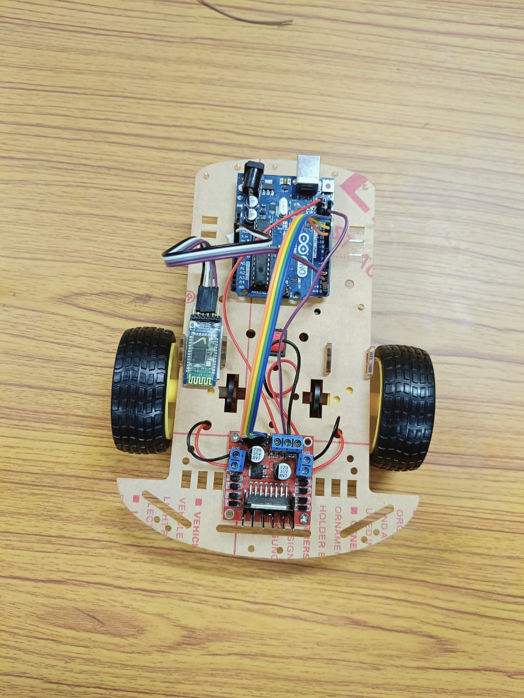
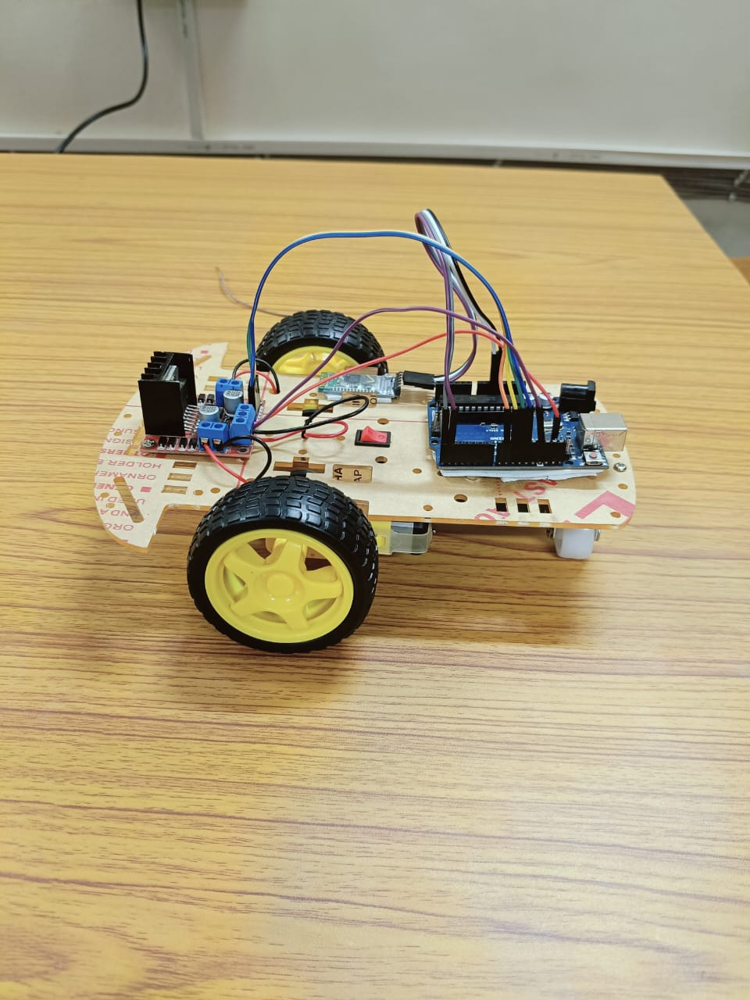
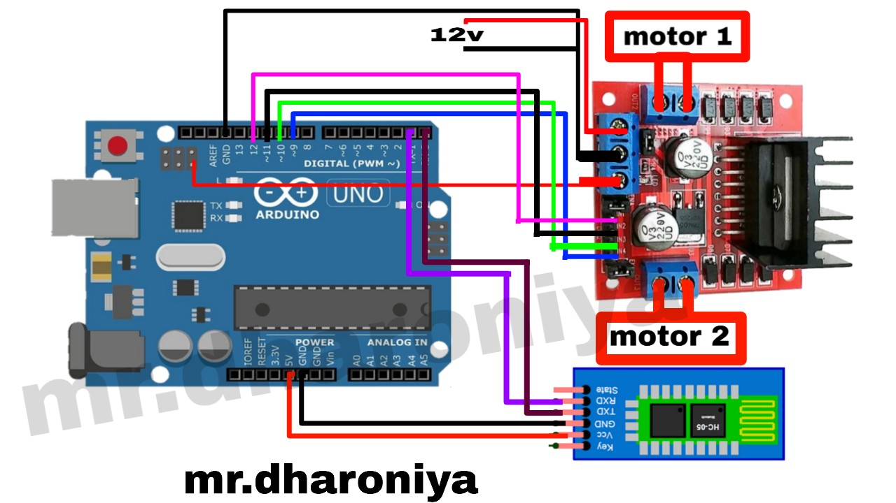

## 🚗 Remote Controlled Bluetooth Car

This project demonstrates a Bluetooth-operated Remote Controlled (RC) car using **Arduino Uno**. The car can be wirelessly controlled using a mobile app via Bluetooth communication. Designed as a beginner-friendly robotics project in the **Tinkering Lab at NIT Patna**, this helped enhance my hands-on skills in embedded systems, wireless control, and microcontroller programming.

---

## 🔧 Tools & Technologies Used

- **Arduino Uno** – Microcontroller board that controls the car's movements
- **HC-05 Bluetooth Module** – Allows wireless communication between the car and mobile phone
- **L298N Motor Driver Module** – Controls the direction and speed of the DC motors
- **DC Motors (x2)** – Power the wheels of the car
- **12V Battery** – Powers the entire setup
- **Chassis, wheels, jumper wires** – Physical structure and wiring

---

## 📝 Project Description

- Developed an Arduino-based RC car controlled via Bluetooth using a smartphone.
- The **HC-05 Bluetooth module** connects to the mobile app, which sends forward, backward, left, and right commands.
- The **Arduino** receives these commands and sends control signals to the **L298N Motor Driver**, which powers the **DC motors** accordingly.
- This project helped me understand basic **embedded systems**, **Bluetooth serial communication**, and **motor driver logic**.

---

## 📲 How It Works

1. Connect the HC-05 Bluetooth module to Arduino (TX, RX, VCC, GND).
2. Use the *Bluetooth RC Controller* Android app to connect with HC-05.
3. Based on the button pressed on the app, characters like F, B, L, R are sent.
4. Arduino code reads these characters via Serial and drives the motors through L298N.

---

## 🧠 Learning Outcomes

- Basics of Bluetooth and serial communication
- Writing Arduino code for wireless control
- Interfacing components (Arduino, Bluetooth, Motor Driver)
- Troubleshooting real-world hardware issues

---

## 📷 Media

### 🔧 RC Car Setup:
  

### 📉 Circuit Diagram:

### 🎥 Demo Video:  
👉 [Watch Demo on Google Drive](https://drive.google.com/file/d/1Isn2PvALLrIhElebB9bnpnUN6x8GbA88/view?usp=drive_link)

---

## 📁 Files

- [bluetooth_car.ino](https://github.com/himanshuraj404/Bluetooth-Car-Project/blob/main/RC_Bluetooth_Car_Code.ino)

---

## 🔗 Future Improvements

- Add obstacle detection using ultrasonic sensor
- Enable voice control commands
- Integrate with IoT platform for remote monitoring

---

## 👨‍💻 Author

**Himanshu Raj** |
B.Tech EE @ NIT Patna  
[GitHub](https://github.com/himanshuraj404) | [LinkedIn](https://linkedin.com/in/himanshurajx)

---
